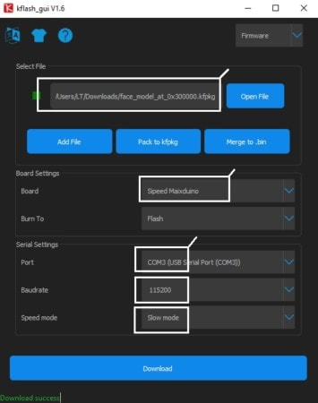

--Usaremos a IDE MaixPy

--requisitos para rodar o codigo:
  i)IDE MaixPy
  
  ii)Kflash_gui(estou usando a versao 1.8.1)(link download:https://github.com/sipeed/kflash_gui)
  
  iii)baixar o modelo para detecçao(https://dl.sipeed.com/MAIX/MaixPy/model)

--Depois de ter tudo isso:
  i)voce deve instalar o modelo com o Kflash_gui
  
